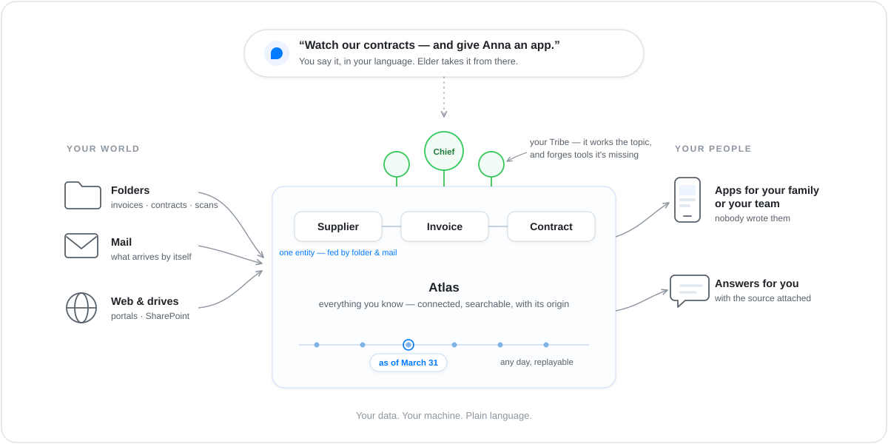
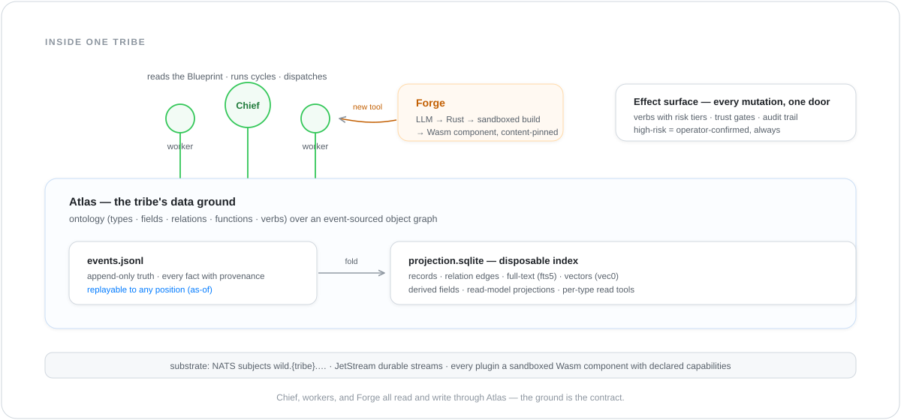

# The idea

> Companion to the [README](../README.md). The README is the
> 60-second pitch; this doc is the deeper *why*.

## A day in the wild

Imagine the drawer where your household paperwork collects —
invoices, insurance letters, contracts. Or the folder on the
department share where supplier invoices land. Somebody has to
read all of it, remember the due dates, notice the odd one out.
Usually that somebody is you. You open The Wild and say:

> *"Watch this folder. I care about due dates and cancellation
> windows — and my partner should be able to see our contracts."*

**Elder** — the gatekeeper of the wilderness, the one fixed point
that talks to every user — listens. Asks a few questions: alert
where? check how often? who may see what? Then it offers to spawn
a **Tribe** — a small autonomous community of specialists — and
you say yes.

What happens next is the part most software skips. Before doing
anything, the Tribe **learns what your things *are***: a
connector mounts the folder, extraction reads the PDFs, and
**Atlas** — the Tribe's data ground — pins the
[ontology](ontology.md): Contract, Partner, Invoice; amounts,
due dates, notice periods; who relates to whom. You add your
mailbox as a second source, and the power bill arriving by e-mail
lands on the *same* Partner as the contract from the folder —
one entity, two provenance lines. It doesn't stop at two: every
artefact that mentions them — the next invoice, a bank export, a
letter about a tariff change — adds to the same Partner, and each
field keeps a pointer back to the page it came from. From now on,
*"which contracts renew in the next sixty days?"* is arithmetic
over a graph, not a guess — and every answer names its source file.

  

The Tribe's **Chief** runs its cycles: new post ingests itself,
the car-insurance cancellation window is flagged three weeks
ahead. Then a provider switches to a scan format the extractor
can't read. The Chief notices the gap, walks over to the
**Forge** — the Tribe's smithy — with a spec, and minutes later a
parser exists that didn't exist before: real code, built in a
sandbox, pinned by content hash, installed behind an approval
gate. You did nothing.

*"Give my partner an app for our contracts."* Elder reads the
ontology and derives one — a table, a detail card, a
cancel-reminder button — and **appd** serves it into your home
network. Your partner opens it on their phone. Nobody wrote code
([how that works](apps.md)).

Months later an auditor-shaped question arrives — *"what did we
know in March?"* — and the Tribe answers from its event stream,
as of March 31st, sources attached. Nothing was ever overwritten;
the past stayed answerable.

That's The Wild. Not an application you start and stop. A tribe
that takes a domain over and grows.

## How the flow works

That story has two layers running at once. The **outer layer** is
the arc you steer — sources in, understanding in the middle,
people out, Elder as the spoken bracket over everything:

  

You reach it through whichever door fits: the **Wild.app**
dashboard, your Desktop AI over MCP, the `wild` CLI — and the
people around you reach it through the apps it serves them.

The **inner layer** is what runs underneath each Tribe:

  

A Tribe is a small community of autonomous inhabitants:

- **Elder** at the system level — onboards new tribes, routes
  you, operates them on your behalf.
- **Atlas** as the ground — the ontology over an event-sourced
  object graph: every fact with its origin, search built in, any
  earlier state replayable.
- A **Chief** per tribe — reads the tribe's Blueprint, runs
  cycles, dispatches work.
- **Workers** — the specialists doing actual tasks: parsing PDFs,
  chasing receivables, scoring, drafting.
- A per-tribe **Forge** that lets the tribe **build new tools for
  itself** when it notices a missing capability.

Each tribe has its own bus prefix (`wild.{tribe}.…`), its own
storage, its own secrets, and its own forge. Tribes can nest
(`acme-sales-eu` is a sub-tribe of `acme-sales`) but stay
strictly isolated — what one tribe knows, another does not see.

## Why not just point an LLM at it?

It's the first question everyone asks, and it deserves a straight
answer. The obvious way to build the story above is to give a
capable model access to every system you own and let it read
whatever it needs, whenever it's asked. Connect the mailbox, the
share, the ERP; the model reads across all of them and answers.

The Wild makes one different move, and everything else follows
from it:

> **The model builds the map once, instead of walking the terrain
> again on every question.**

Talking to Elder *is* the modelling step. You describe your
sources and how they relate; the ontology that comes out is a
durable thing that outlives the conversation. Afterwards a
question is answered against that model — the LLM translates
what you asked, it doesn't re-read your files to find out.

  

Read the same six rows twice — once as the read-everything
approach, once as The Wild:

| | Read it all, every time | Model it once |
|---|---|---|
| **Per question** | every source re-read into a context window | one query against a model that already exists |
| **Cost** | grows with every question, forever | front-loaded; questions get cheap |
| **Answers** | the model asserts from fragments it just read | records answer, each naming its source |
| **Permission** | nothing to attach a grant to | the ontology *is* what grants attach to |
| **Exposure** | your corpus travels into the window | a query result travels; the corpus stays |
| **History** | each run is thrown away | an event stream — earlier states replay |

The permission row is the one that gets underrated. It isn't
"we also have access control" — it's structural. When the unit of
work is a context chunk or a tool call, there is no object a
grant could sit on: you cannot grant a field, revoke a type, or
audit who saw which record, because none of those exist as
things. In The Wild they do. `customer_visible` is a mark on a
Type or a Field, and it governs both seeing and writing. The same
is true for provenance: an answer can name its source file
because the fact was stored with its origin, not because a model
remembered where it read something.

Be fair about the other side, because it's sometimes right. For a
one-off question over material you'll never touch again, pointing
a model at it and paying for the read is the correct trade — The
Wild's setup earns nothing there. The trade flips as soon as the
same domain comes back: the read-everything approach pays full
price on every repeat, while a model you built once keeps
answering, and each new source makes it richer instead of making
the next read longer.

**Be precise about the time axis.** What replays today is the
*knowledge* axis: what the Tribe knew, and when — event-sourced,
with deterministic as-of reads. Asking *"what did we know in
March?"* works. The second axis — since when a fact was true in
the world, independent of when you learned it — is designed but
not yet readable (ADR-0201);
until it lands, this is replayable knowledge, not bitemporal
records.

> 🔍 **Dig deeper — the ground this rests on.**
>
> - **Concept:** [`ontology.md`](ontology.md) (the model in plain
>   words) · `atlas.md` (event stream, provenance,
>   as-of reads) · `atlas-vocabulary.md`
>   (every mark, with its shipped state).
> - **Permission:** `customer_visible` —
>   ADR-0083 ·
>   ADR-0220. Role-based access over
>   proposals is a separate, opt-in gate (`WILD_RBAC_ENABLED`,
>   off by default — [`config-vars.md`](config-vars.md)).
> - **Time:** ADR-0201 — the
>   valid-time carrier and the two-axis read.

## What's different about it

The section above is the frame; these are the five properties
that make it hold.

**1. It stands on ground, not glue.** Classic LLM-agent systems
are loops *between* other people's tools; their memory is a
scratchpad of prompts. Every Tribe in The Wild stands on its own
data ground: an ontology of real entities fed from many sources,
an append-only event stream as truth, provenance on every fact,
full-text and vector search built in, any earlier state of
knowledge replayable. Throw away every prompt and the knowledge
survives. This is the property everything else leans on —
computed answers with receipts, honest history, and apps derived
rather than developed. ([ontology.md](ontology.md) ·
atlas.md)

Step back from any single record and you see what that means. The
record is an instance of a **type** you declared once — its fields,
its relations to other types, and the effects it permits. That type
is one node in the model of your whole domain, and everything else
reads it: the answers, the apps, the workers. Nobody re-invents what
a Partner is.

  

One type is not yet a domain. What makes the ground load-bearing is
that the types know each other: a Contract belongs to a Partner, an
Invoice is billed under a Contract, a Payment settles an Invoice.
Those named relations are why *"which contracts renew in the next
sixty days?"* is a walk rather than a guess. And because each type
also declares what may be **done** to it, the same model says which
of those actions the Tribe may take on its own and which wait for
you — sending a reminder, yes; writing an invoice off, not without
a person.

  

**2. Tribes generate their own tools.** The Forge is a
sandbox-isolated build pipeline:

- The Chief notices: *"For this task I'm missing a tool — I need
  something that parses XML sitemaps."*
- It generates Rust source code via the LLM (with a strict crate
  allowlist).
- The Forge hands the code to a Docker sandbox, builds it into a
  WebAssembly component, signs it, pushes it to an OCI registry as
  an artefact.
- The host pulls the artefact, registers it as a plugin behind an
  approval gate, and the tribe uses the new tool from the next
  cycle on.

This is why a tribe is **self-generative**: it isn't limited to
the tools we ship — it can build tools we never knew it would
need. ADR-0012 documents the lockdown layers that prevent a
hostile LLM from making the forge build adapters with
filesystem/network keys; only `tool-provider` and `workload`
flavors are forge-buildable.

**3. The vocabulary is concrete, not abstract.** "Agent" is heavily
loaded in the LLM ecosystem ("agentic AI", "agent framework"). The
Wild deliberately picks more concrete terms:

- **Tribe** — a clan with territory, possessions, and a mission.
- **Elder** — the gatekeeper who introduces the user to the
  wilderness.
- **Atlas** — the tribe's data ground; the map of everything it
  knows.
- **Chief** — the orchestrator of one tribe.
- **Worker** — does the actual work; can be ai-, rule-, shell-,
  api-, or human-backed.
- **Forge** — the smithy where the tribe forges new tools.
- **Blueprint** — a tribe's living charter, a Markdown document the
  Chief reads every cycle and may rewrite.

The concrete framing keeps the architecture honest about who does
what — the [README](../README.md#why-tribe-why-wild) makes the
case that these names are load-bearing, and
[the cast sheet](diagrams/idea/scenes/04-the-cast.svg) puts all
six on one page with how many of each live where.

**4. WebAssembly is the sandbox.** Every plugin (LLM adapters, tool
providers, workers, chiefs) runs as a WebAssembly component:
language-agnostic source (Rust today, others tomorrow), no ambient
filesystem or network access (capabilities granted explicitly via
WIT contracts), signed and trust-tiered for distribution. This is
what makes plugin-on-demand safe: a tribe can install community
plugins and forge-built ones with the same isolation guarantees as
the built-in ones.

**5. NATS is the bus, JetStream is the durability.** All inter-
component traffic is on NATS subjects (`wild.{tribe}.…`). Workers,
chiefs, providers — everyone publishes and subscribes. Per-tribe
isolation is enforced at the subject-prefix level. JetStream backs
the durable streams; SQLite carries the derived read-side for fast
joins.

## Who it's for — the entry ladder

The path into The Wild is deliberately a ladder, and it starts at
home:

- **The home user** — the entry persona. Installs `Wild.app`,
  points it at the household folder, gets the contracts app on
  the family's phones. No server, no IT department, no terminal.
  Everything runs on one machine; with a local model, nothing
  leaves the house.
- **The domain expert** — the accountant, the purchasing lead,
  the operations person. Same system, pointed at a department's
  folder. They are experts in their domain, not engineers — so
  the surface stays plain language, safe defaults, honest status.
  This persona is the product's design gate: every feature must
  be drivable by them, end to end.
- **The operator** — runs The Wild for a team, manages profiles
  and plugin trust tiers, watches the audit trail.
- **The plugin author** — writes new connectors, tools, or
  adapters as WebAssembly components and distributes them via
  OCI. Enters through the
  developer front door.

The ladder is the go-to-market: what runs your kitchen table
today runs an accounts-payable desk tomorrow — same system,
nothing to migrate.

## What it's not (yet)

- **Not a chat front-end.** Claude / Gemini / OpenAI do that
  better. The Wild is the layer **behind** the chat: the orchestra
  that keeps working between your messages.
- **Not multi-operator out of the box.** One operator per install
  today. The people around you get governed, per-person **apps**
  — but co-operating a tribe (shared operation, federation) gets
  its own ADR when there's actual demand.
- **Not a public app store.** There is a curated
  marketplace of connectors, workers, and
  domain packages — but no open third-party marketplace yet;
  community plugins install via explicit `oci://…` refs.
- **Not stable.** Pre-1.0; ADRs are the closest thing to a
  changelog. See the
  developer front door §Status for
  what shipped recently.

## What to read next

- [`ontology.md`](ontology.md) — the ontology in plain words:
  Ingest · Entities · Effects · Workers, and where you see them.
- [`showcase-fitness.md`](showcase-fitness.md) ·
  [`showcase-liquidity.md`](showcase-liquidity.md) — the two
  guided tours, home and business.
- [`how-tribes-live.md`](how-tribes-live.md) — the life-story:
  how a Tribe works, remembers, learns, and forges new abilities.
- [`apps.md`](apps.md) — one sentence to a governed app.
- [`architecture.md`](architecture.md) — the technical *how*:
  embedded host, capability model, plugin tiers.
- [`installation.md`](installation.md) — first install, first
  boot, talking to Elder.
- `elder.md` — how Elder steers the conversation.
